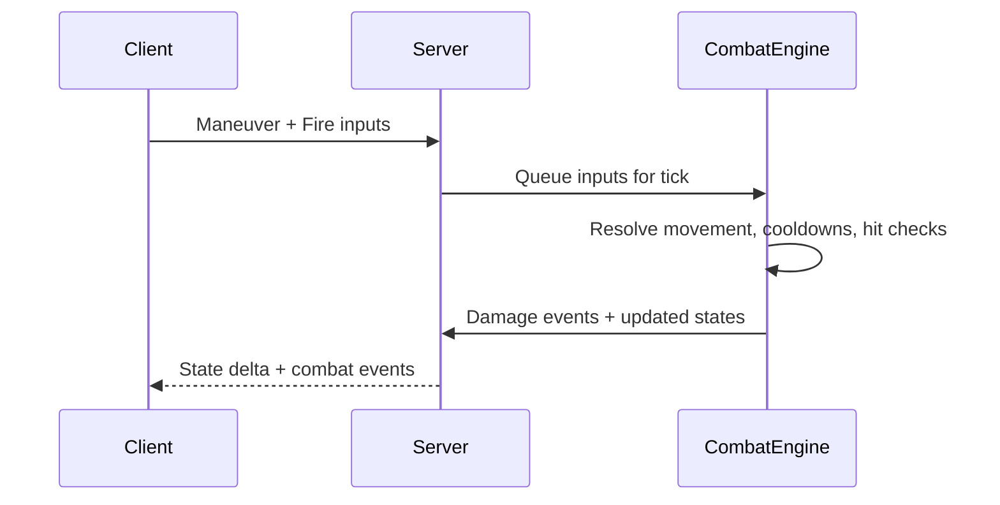
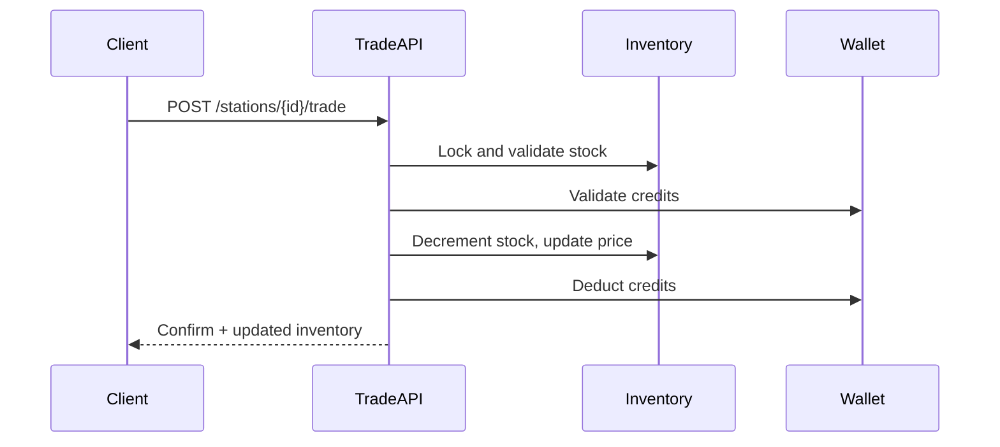
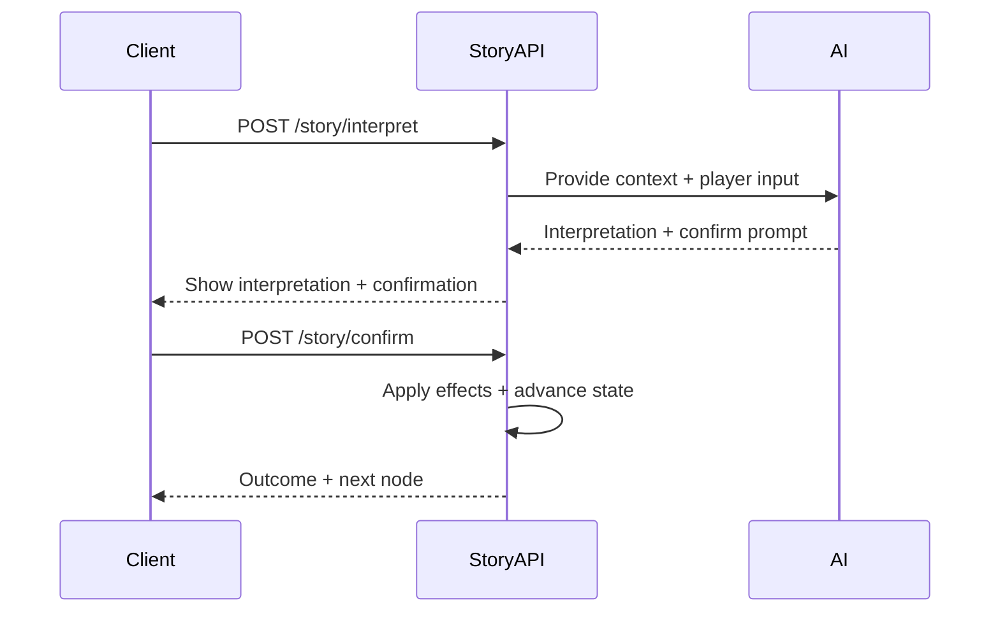
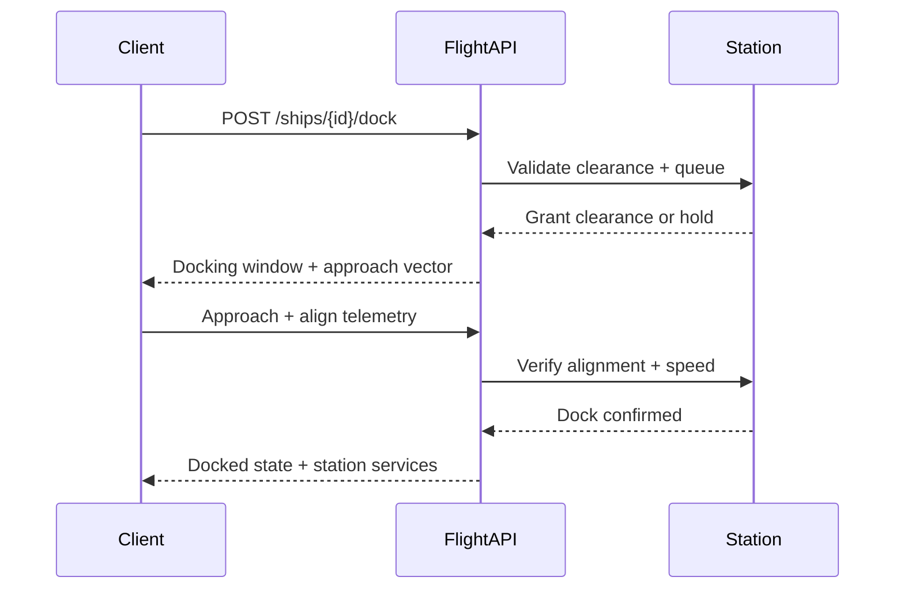
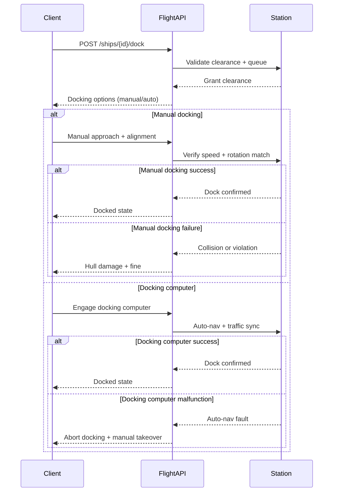
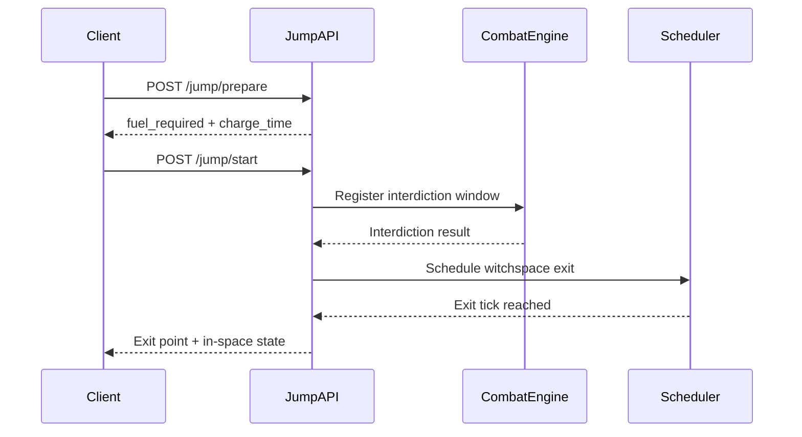
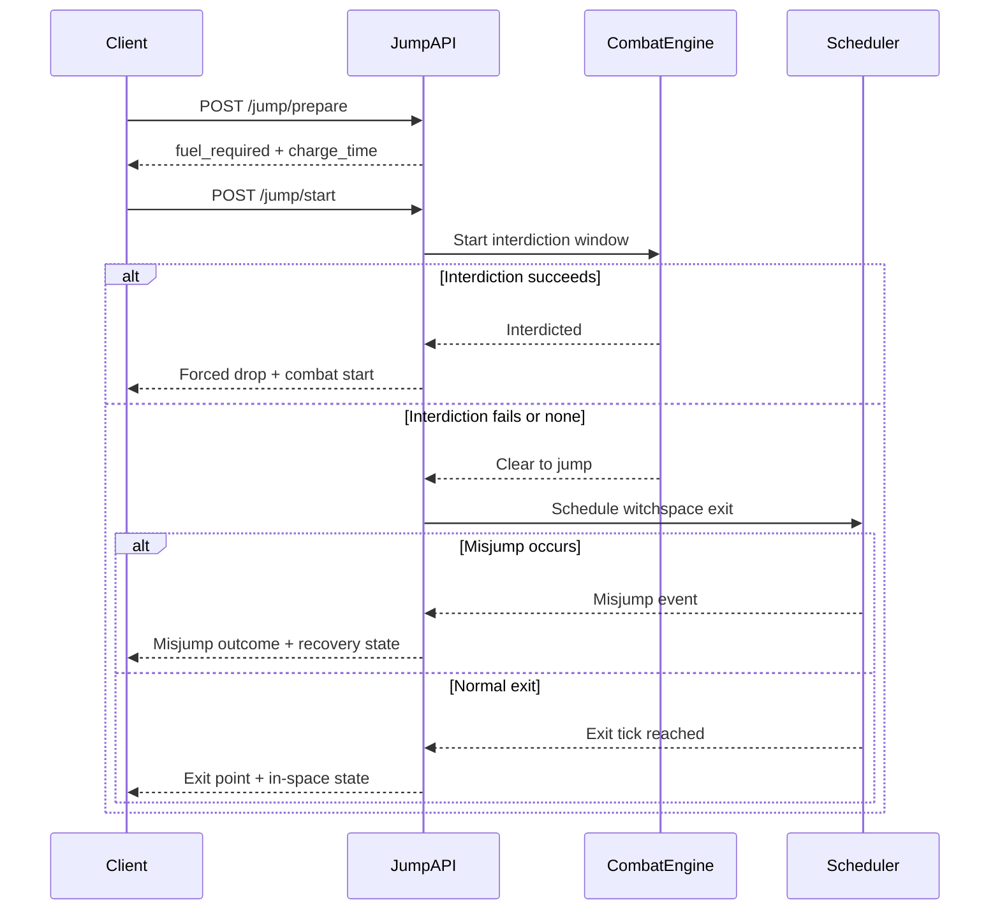
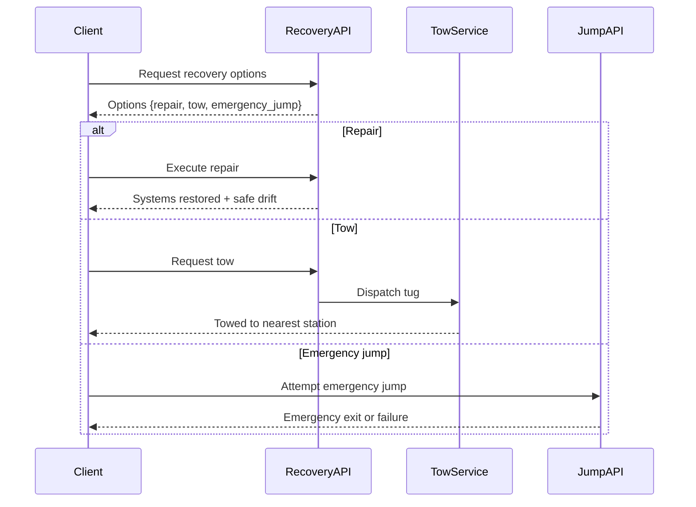
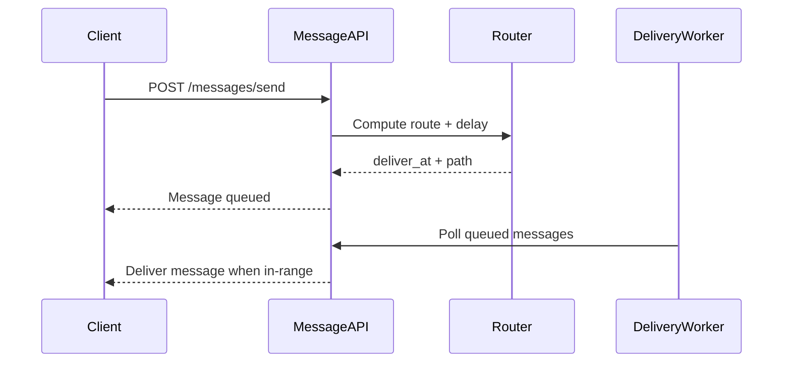

Elite Chronicles - Product Requirements Document (PRD)
Version: 0.4
Date: 2026-02-09
Owner: Lee

Summary
Elite Chronicles is a browser-based, multiplayer space trading and exploration game inspired by 1980s Elite, blending real-time spaceflight with AI-assisted text adventure sequences. The game features a persistent world, a dynamic economy, and a communication system that models distance-based message delays. This PRD captures product goals, functional requirements, non-functional requirements, and delivery phases.

1. Goals and Non-Goals

1.1 Goals
- Deliver a playable core loop: fly, trade, fight, dock, and embark on text adventures.
- Enable a persistent multiplayer universe with shared systems and real-time local chat.
- Provide AI-assisted text adventures with a confirmation step for player intent.
- Implement a dynamic economy with production and consumption that is configurable.
- Provide secure authentication, admin tools, and robust logging.

1.2 Non-Goals (initial release)
- Full N-body orbital mechanics simulation.
- Voice chat or real-time audio comms.
- Player-built stations or ships.
- Full 3D character models for on-foot gameplay.

2. Target Audience and Personas

2.1 Target Audience
- Fans of classic space sims (Elite, Freelancer).
- Players who enjoy interactive fiction and narrative choice.
- Sandbox players interested in emergent multiplayer economies.

2.2 Personas
- Trader: Optimizes routes, focuses on economy, prefers low combat.
- Bounty Hunter: Seeks combat and reputation gains.
- Explorer: Focuses on discovery and narrative content.
- Social Captain: Plays with friends, coordinates via comms.

3. Product Pillars
- Agency: Open-ended playstyles (trade, fight, explore, story).
- Immersion: Retro-futuristic visuals plus text adventure depth.
- Persistence: Shared world, durable player history, and economy.
- Clarity: AI text interpretation must be confirmed by player.

4. Core Game Loop
1) Launch or resume session.
2) Travel within a system or jump to another.
3) Trade, fight, or explore.
4) Dock at a station or land on a planet.
5) Enter text adventure mode or station services.
6) Receive new missions or upgrades.
7) Repeat.

5. Functional Requirements

5.1 Accounts and Authentication
- Register with email, username, password.
- Login and session management with secure cookies or JWT.
- Role-based access (user, admin, moderator).
- Forgot password flow with secure, expiring token.
- Token refresh (if used) and clear 401 handling.

5.2 Player State
- Track player status: alive/dead, in-ship or on-foot (station/planet).
- Persist player location (system, station, or deep space).
- Maintain player credits, reputation, and faction alignment.
- Track player history: combat engagements, trades, missions, story choices.

5.3 Ship State and Flight Metrics
- Ship position, velocity, speed, and direction stored server-side.
- Fuel and energy tracked with consumption rules.
- Weapons inventory with ammo or energy usage.
- Shields with recharge rules and maximum capacity.
- Hull integrity and module health for damage tracking.
- Docking and undocking flows with proximity checks.
- Hyperspace jump constraints include gravity well exclusion zones and charge time.
- Exit-point drift is applied to hyperspace arrivals and reduced by upgrades.
- Misjumps can occur due to heat, damage, or low-grade fuel.

5.3.1 Jump Mechanics
- Jump initiation requires sufficient fuel, no docking state, and no gravity well violation.
- Jump charge time scales by ship mass, drive class, and current heat.
- Interdiction can interrupt charging and force a drop into normal space.
- Exit-point drift is applied on arrival; upgraded hyperspace computers reduce drift.
- Misjumps trigger a recovery state (repair, tow, or emergency jump).

5.3.2 Tactical Scanner Range and Scale
- Flight scanner grid is a local tactical display and must not render deep-system contacts as near.
- Default scanner grid render cap is 100 km from player ship.
- Player can change scanner range using presets: 25 km, 50 km, 100 km, 250 km, 500 km.
- Contacts beyond the active scanner range are excluded from on-grid blip rendering.
- Out-of-range contacts remain available in scanner contact list with true distance labels.
- Scanner UI displays the active range preset and preserves it in player preferences.

5.4 Space Combat
- Server-authoritative combat simulation with tick updates.
- Damage resolution: shields absorb before hull.
- Shield recharge delay after taking damage.
- Weapons can consume energy or ammo, and respect cooldowns.
- Components can be damaged when hull is low.
- Player death flow: escape pod if equipped, else respawn policy.

5.5 Ship Upgrades
- Upgrades available only at stations/planets with required tech level.
- Purchases require sufficient credits and inventory availability.
- Upgrade categories: hull, shields, power, engines, weapons, sensors, cargo.
- Installation uses ship slots (utility, internal, hardpoint, engine, shield).
- Recalculate ship stats after installation.
- Hyperspace computers reduce drift and misjump chance and can add interdiction resistance.

5.6 Economy and Trading
- Station inventories fluctuate with player buy/sell activity.
- NPC production replenishes inventory based on system type.
- Local consumption reduces inventory over time.
- Rates are configurable by station and commodity.
- Prices respond to supply/demand and faction modifiers.
- NPC trade fleets move goods between systems and affect local prices.
- Economy events (shortage, boom, pirate raids) can shift prices and availability.
- Illegal goods require stealth handling and may trigger scans, fines, or confiscation.
- Black market prices apply to restricted or illegal commodities.

5.7 Stations and Planetary Locations
- Multiple station archetypes: Coriolis, Orbis, Outpost, MegaStation, Planetary Port.
- Each station has size, shape, color palette, and services.
- Services include: market, repairs, upgrades, missions, text adventure entry.
- Station appearance and services influenced by faction and tech level.

5.8 Text Adventure Mode (AI Assisted)
- Triggered when docked or landed at a location with story content.
- Free-form player input is interpreted by AI using:
	- Location description
	- Player inventory
	- Nearby objects
	- Current story state
- AI must return an interpretation and ask for confirmation before action.
- Confirmed actions apply effects and update state.
- AI output is moderated for safety and relevance.

5.9 Communication System
- Local real-time chat for players in the same station or system.
- Interstellar messaging uses relay nodes with delay based on distance.
- Messages delivered when recipient is in range or online.
- Optional message TTL and delivery status tracking.
- Rate limits and moderation for abuse prevention.
- Interstellar routing uses relay path calculation (hop count and latency per hop).

5.10 Missions and Reputation
- Missions generated by factions and stations.
- Reputation changes based on mission outcome or trade behavior.
- Mission rewards include credits, items, and reputation boosts.

5.11 Admin Panel
- Access limited to admin role.
- Manage users: activate, deactivate, delete.
- View and adjust game settings and economy parameters.
- Content moderation for AI-generated stories.
- System monitoring: health, uptime, basic usage stats.
- Logs viewer with tail length, follow mode, and regex filters.

5.12 Logging and Error Handling
- Rotating logs stored under data/logs (app, api, error, auth).
- Redact sensitive data (tokens, credentials, personal info).
- Graceful error messages for timeouts, invalid JSON, image errors.
- Retry queue for transient failures.

5.13 State Management and Recovery
- Autosave on key events (dock, trade, combat end, story choice).
- Session restore on reconnect.
- Crash recovery returns player to safe state.
- Versioned save snapshots for rollback.

5.14 User Stories and Acceptance Criteria

Authentication and Access
- Story: As a player, I want to register and log in securely so my progress is preserved.
	- Acceptance: Registration creates a user record and returns a session or token.
	- Acceptance: Login fails with a clear error for invalid credentials.
	- Acceptance: Password reset token expires and cannot be reused.
- Story: As an admin, I want access to admin tools so I can manage users and content.
	- Acceptance: Admin routes reject non-admin users with 403.

Player and Ship State
- Story: As a player, I want my ship and location to persist across sessions.
	- Acceptance: Reconnect places the player in the last known state.
- Story: As a player, I want fuel, shields, and energy tracked accurately.
	- Acceptance: Fuel decreases when traveling or jumping based on rules.
	- Acceptance: Shields recharge only after a no-hit delay.

Combat
- Story: As a bounty hunter, I want combat to feel fair and deterministic.
	- Acceptance: Damage resolution is server-authoritative.
	- Acceptance: Weapon cooldowns prevent rapid firing.
- Story: As a player, I want to survive via escape pods when destroyed.
	- Acceptance: If an escape pod is installed, respawn flow preserves basic inventory.

Upgrades
- Story: As a player, I want to upgrade my ship at stations based on credits and availability.
	- Acceptance: Purchase fails with insufficient credits or missing stock.
	- Acceptance: Upgrades consume a valid slot and update ship stats.

Economy and Trading
- Story: As a trader, I want station inventory to change based on buying and selling.
	- Acceptance: Buy decreases stock and increases price; sell increases stock.
	- Acceptance: Production and consumption change inventory over time.

Stations and Locations
- Story: As a player, I want stations to look and feel different.
	- Acceptance: Stations vary by archetype, palette, and services.

Text Adventure
- Story: As a player, I want to use free-form text in story scenes and confirm my intent.
	- Acceptance: AI response includes an interpretation and requires confirmation.
	- Acceptance: Confirmed actions update story and game state.

Communication
- Story: As a player, I want real-time chat locally and delayed messages across systems.
	- Acceptance: Local chat appears instantly in the same station or system.
	- Acceptance: Interstellar messages deliver after calculated delays.

Admin and Observability
- Story: As an admin, I want to view logs and adjust settings.
	- Acceptance: Logs support tail length, follow mode, and regex filter.

6. Data and System Model (Schema Outline)

6.1 Authentication and User
- users: id, email, username, password_hash, role, status, created_at, last_login_at, is_alive, location_type, location_id, credits, faction_id
- roles: id, name, permissions_json
- sessions: id, user_id, created_at, expires_at, ip_address, user_agent, revoked_at
- password_reset_tokens: id, user_id, token_hash, expires_at, used_at
- audit_logs: id, actor_user_id, action, target_type, target_id, metadata_json, created_at

6.2 World and Locations
- star_systems: id, name, seed, position_x, position_y, position_z, economy_type, tech_level, faction_id
- planets: id, system_id, name, type, orbital_elements_json, ai_story_available
- stations: id, system_id, name, archetype_id, position_x, position_y, position_z, services_json, faction_id, tech_level, ai_story_available
- station_archetypes: id, name, size_class, shape, palette_json, features_json

6.3 Ships and Loadouts
- ships: id, owner_user_id, name, hull_max, hull_current, shields_max, shields_current, energy_cap, energy_current, fuel_cap, fuel_current, position_x, position_y, position_z, velocity_x, velocity_y, velocity_z, status, docked_station_id, last_update_at, version
- ship_slots: id, ship_id, slot_type, slot_index
- ship_modules: id, name, category, slot_type, stats_json, tech_level, mass, power_draw, cooldown, ammo_capacity
- ship_loadout: id, ship_id, slot_id, module_id, installed_at
- ship_damage: id, ship_id, component_name, damage_state, updated_at
- hyperspace_computers: id, name, tier, drift_min_km, drift_max_km, misjump_rate, interdiction_modifier, fuel_efficiency_modifier, rarity, faction_requirement, cost

6.4 Economy and Market
- commodities: id, name, category, base_price, volatility, illegal_flag
- station_inventory: id, station_id, commodity_id, quantity, max_capacity, buy_price, sell_price, updated_at, version
- station_economy_rules: station_id, commodity_id, production_rate, consumption_rate, npc_trade_bias, updated_at
- market_history: id, station_id, commodity_id, price, quantity, recorded_at

6.5 Factions and Missions
- factions: id, name, alignment, reputation_scale
- missions: id, faction_id, station_id, type, status, reward_credits, reward_items_json, start_at, expire_at
- mission_assignments: id, mission_id, user_id, status, accepted_at, completed_at
- reputation: id, user_id, faction_id, value, updated_at

6.6 Story and AI
- story_sessions: id, user_id, location_type, location_id, status, created_at, updated_at
- story_nodes: id, session_id, title, body, image_url, created_at
- story_choices: id, node_id, choice_text, effect_json, next_node_id
- story_context: id, session_id, state_json, flags_json
- ai_logs: id, user_id, session_id, request_json, response_json, created_at, redacted

6.7 Combat
- combat_sessions: id, system_id, status, created_at, ended_at
- combat_participants: id, combat_session_id, ship_id, user_id, side, status
- combat_logs: id, combat_session_id, attacker_ship_id, target_ship_id, weapon_id, damage, shield_damage, hull_damage, timestamp

15. UI Foundations (Post-Prototype)
- A shared UI foundations checklist governs cross-application primitives for tooltips, toasts, and empty states.
- See [ui-foundations-checklist.md](ui-foundations-checklist.md) for rollout phases and acceptance criteria.

6.8 Communication
- communication_nodes: id, system_id, station_id, relay_range, latency_per_hop, processing_delay
- messages: id, sender_id, receiver_id, content, path_json, deliver_at, delivered_at, status
- chat_logs: id, location_type, location_id, sender_id, content, created_at

6.9 Logging
- app_logs: id, level, message, created_at
- api_logs: id, method, path, status, duration_ms, created_at
- error_logs: id, error_code, message, stack, created_at
- auth_logs: id, user_id, action, ip_address, created_at

6.10 Indices and Constraints
- Unique: users.email, users.username
- Foreign keys: enforced for all relationships
- Version columns for optimistic locking on ships and station_inventory
- Indexes: sessions.user_id, stations.system_id, station_inventory.station_id, messages.receiver_id, combat_sessions.system_id

6.11 SQL-Ready Schema (Core Tables)
Note: Types are expressed in PostgreSQL style. Adjust for other engines if needed.

users
```sql
CREATE TABLE users (
	id BIGSERIAL PRIMARY KEY,
	email TEXT NOT NULL UNIQUE,
	username TEXT NOT NULL UNIQUE,
	password_hash TEXT NOT NULL,
	role TEXT NOT NULL DEFAULT 'user',
	status TEXT NOT NULL DEFAULT 'active',
	is_alive BOOLEAN NOT NULL DEFAULT TRUE,
	location_type TEXT,
	location_id BIGINT,
	credits BIGINT NOT NULL DEFAULT 0,
	faction_id BIGINT,
	created_at TIMESTAMPTZ NOT NULL DEFAULT NOW(),
	last_login_at TIMESTAMPTZ
);
```

sessions
```sql
CREATE TABLE sessions (
	id UUID PRIMARY KEY,
	user_id BIGINT NOT NULL REFERENCES users(id) ON DELETE CASCADE,
	created_at TIMESTAMPTZ NOT NULL DEFAULT NOW(),
	expires_at TIMESTAMPTZ NOT NULL,
	ip_address INET,
	user_agent TEXT,
	revoked_at TIMESTAMPTZ
);
CREATE INDEX sessions_user_id_idx ON sessions(user_id);
```

ships
```sql
CREATE TABLE ships (
	id BIGSERIAL PRIMARY KEY,
	owner_user_id BIGINT NOT NULL REFERENCES users(id) ON DELETE CASCADE,
	name TEXT NOT NULL,
	hull_max INTEGER NOT NULL,
	hull_current INTEGER NOT NULL,
	shields_max INTEGER NOT NULL,
	shields_current INTEGER NOT NULL,
	energy_cap INTEGER NOT NULL,
	energy_current INTEGER NOT NULL,
	fuel_cap INTEGER NOT NULL,
	fuel_current INTEGER NOT NULL,
	position_x DOUBLE PRECISION NOT NULL DEFAULT 0,
	position_y DOUBLE PRECISION NOT NULL DEFAULT 0,
	position_z DOUBLE PRECISION NOT NULL DEFAULT 0,
	velocity_x DOUBLE PRECISION NOT NULL DEFAULT 0,
	velocity_y DOUBLE PRECISION NOT NULL DEFAULT 0,
	velocity_z DOUBLE PRECISION NOT NULL DEFAULT 0,
	status TEXT NOT NULL DEFAULT 'in-space',
	docked_station_id BIGINT REFERENCES stations(id),
	last_update_at TIMESTAMPTZ NOT NULL DEFAULT NOW(),
	version BIGINT NOT NULL DEFAULT 0
);
CREATE INDEX ships_owner_user_id_idx ON ships(owner_user_id);
```

stations
```sql
CREATE TABLE stations (
	id BIGSERIAL PRIMARY KEY,
	system_id BIGINT NOT NULL REFERENCES star_systems(id) ON DELETE CASCADE,
	name TEXT NOT NULL,
	archetype_id BIGINT NOT NULL REFERENCES station_archetypes(id),
	position_x DOUBLE PRECISION NOT NULL,
	position_y DOUBLE PRECISION NOT NULL,
	position_z DOUBLE PRECISION NOT NULL,
	services_json JSONB NOT NULL DEFAULT '{}'::jsonb,
	faction_id BIGINT REFERENCES factions(id),
	tech_level INTEGER NOT NULL DEFAULT 0,
	ai_story_available BOOLEAN NOT NULL DEFAULT FALSE
);
CREATE INDEX stations_system_id_idx ON stations(system_id);
```

station_inventory
```sql
CREATE TABLE station_inventory (
	id BIGSERIAL PRIMARY KEY,
	station_id BIGINT NOT NULL REFERENCES stations(id) ON DELETE CASCADE,
	commodity_id BIGINT NOT NULL REFERENCES commodities(id) ON DELETE CASCADE,
	quantity INTEGER NOT NULL DEFAULT 0 CHECK (quantity >= 0),
	max_capacity INTEGER NOT NULL CHECK (max_capacity >= 0),
	buy_price INTEGER NOT NULL CHECK (buy_price >= 0),
	sell_price INTEGER NOT NULL CHECK (sell_price >= 0),
	updated_at TIMESTAMPTZ NOT NULL DEFAULT NOW(),
	version BIGINT NOT NULL DEFAULT 0,
	UNIQUE (station_id, commodity_id)
);
CREATE INDEX station_inventory_station_id_idx ON station_inventory(station_id);
```

story_sessions
```sql
CREATE TABLE story_sessions (
	id BIGSERIAL PRIMARY KEY,
	user_id BIGINT NOT NULL REFERENCES users(id) ON DELETE CASCADE,
	location_type TEXT NOT NULL,
	location_id BIGINT NOT NULL,
	status TEXT NOT NULL DEFAULT 'active',
	created_at TIMESTAMPTZ NOT NULL DEFAULT NOW(),
	updated_at TIMESTAMPTZ NOT NULL DEFAULT NOW()
);
CREATE INDEX story_sessions_user_id_idx ON story_sessions(user_id);
```

messages
```sql
CREATE TABLE messages (
	id BIGSERIAL PRIMARY KEY,
	sender_id BIGINT NOT NULL REFERENCES users(id) ON DELETE CASCADE,
	receiver_id BIGINT NOT NULL REFERENCES users(id) ON DELETE CASCADE,
	content TEXT NOT NULL,
	path_json JSONB NOT NULL DEFAULT '[]'::jsonb,
	deliver_at TIMESTAMPTZ NOT NULL,
	delivered_at TIMESTAMPTZ,
	status TEXT NOT NULL DEFAULT 'queued'
);
CREATE INDEX messages_receiver_id_idx ON messages(receiver_id);
CREATE INDEX messages_deliver_at_idx ON messages(deliver_at);
```

7. API Requirements and Error Contracts

7.1 Authentication
- POST /api/auth/register
- POST /api/auth/login
- POST /api/auth/logout
- POST /api/auth/forgot
- POST /api/auth/reset

7.2 Player and Ship
- GET /api/players/me
- GET /api/ships/{id}
- POST /api/ships/{id}/maneuver
- POST /api/ships/{id}/dock
- POST /api/ships/{id}/undock
- POST /api/ships/{id}/refuel
- POST /api/ships/{id}/fire
- POST /api/ships/{id}/upgrade
- POST /api/jump/prepare
- POST /api/jump/start
- POST /api/jump/cancel
- GET /api/jump/status/{jump_id}

7.3 Economy and Trading
- GET /api/stations/{id}/inventory
- POST /api/stations/{id}/trade
- GET /api/markets/{system_id}/summary

7.4 Missions and Reputation
- GET /api/missions
- POST /api/missions/{id}/accept
- POST /api/missions/{id}/complete
- GET /api/reputation

7.5 Story and AI
- POST /api/story/start/{location_id}
- POST /api/story/interpret
- POST /api/story/confirm
- POST /api/story/proceed

7.6 Communication
- WS /ws/system/{system_id}
- WS /ws/station/{station_id}
- WS /ws/player/{player_id}
- POST /api/messages/send
- GET /api/messages/inbox

7.7 Admin
- GET /api/admin/users
- PATCH /api/admin/users/{id}
- GET /api/admin/logs
- GET /api/admin/metrics
- PATCH /api/admin/settings

7.8 Auth and Headers
- All protected routes require Authorization: Bearer <token> or secure session cookie.
- Idempotency-Key supported on trade, upgrade, and purchase endpoints.
- X-Request-Id required for tracing and retry safety.

7.9 Error Contract
All API errors return JSON:
{
	"error": {
		"code": "string",
		"message": "string",
		"details": "string or object",
		"trace_id": "string"
	}
}

Standard error codes:
- invalid_json (400)
- unauthorized (401)
- forbidden (403)
- not_found (404)
- conflict_version (409)
- rate_limited (429)
- ai_timeout (504)
- image_error (502)
- validation_failed (422)

7.10 Sequence Flows

Combat Flow (real-time tick)


Trading Flow (buy commodity)


Story Confirmation Flow


Docking Flow (manual or assisted)


Docking Flow (manual vs docking computer)


Hyperspace Jump Flow


Hyperspace Jump Flow (interdiction branch)


Misjump Recovery Flow (repair, tow, or emergency jump)


Interstellar Messaging Flow (delayed)


8. AI Interaction Requirements
- Input schema includes location, inventory, state, and player input.
- Output schema includes interpretation, action intent, and confirmation prompt.
- Confirmation must be explicit before state changes.
- All AI prompts and outputs stored in AI logs.

9. Economy Simulation Rules
- Each station has production rates per commodity.
- Each station has consumption rates per commodity.
- NPC trader activity can optionally simulate external supply.
- All rates are configurable via settings.

10. UX and Visual Direction
- Spaceflight uses retro-futuristic vector style.
- Text adventure uses stylized imagery matching scene tone.
- Stations are visually distinct by archetype, palette, and silhouette.

11. Non-Functional Requirements
- Security: HTTPS, rate limits, password hashing, CSRF protection.
- Performance: local chat latency under 200ms target.
- Availability: recover from service failures without data loss.
- Scalability: WebSocket sharding and worker queues for AI.
- Observability: logs with structured metadata and redaction.

12. Analytics and Success Metrics
- DAU and retention (D1, D7, D30).
- Number of completed missions per player.
- Trade volume per system and economy health.
- Average time in text adventure mode.
- Chat usage and delivery latency distributions.

13. Risks and Mitigations
- AI hallucinations: require confirmation step and moderation.
- Economy exploits: server-authoritative transactions and rate limits.
- Cheating: server-driven movement and combat resolution.
- Content abuse in chat: filters, rate limits, report tools.

14. Open Questions
- Level of orbital mechanics realism.
- Respawn policy (permadeath vs penalty).
- Mission generation approach (scripted vs AI-driven).
- Cross-platform support beyond browser.

15. Delivery Phases
Phase 1: Prototype
- Single-player loop: travel, dock, basic trade, one text adventure.

Phase 2: Core Systems
- Auth, sessions, ship state, economy tick, logs.

Phase 3: Multiplayer
- WebSockets, local chat, shared systems.

Phase 4: AI Story Integration
- Free-form input, confirmation step, moderation.

Phase 5: Expanded Universe
- More stations, factions, missions, and tuning.

15.1 Next Execution Batch
- See [batch-01-core-systems-plan.md](batch-01-core-systems-plan.md) for scoped implementation sequencing and acceptance criteria.

15.2 Following Execution Batch
- See [batch-02-economy-logs-plan.md](batch-02-economy-logs-plan.md) for scope covering economy tick baseline and logs API baseline.

15.3 Current Visual/Flight Batch
- See [batch-07-docking-undocking-ship-station-visuals-plan.md](batch-07-docking-undocking-ship-station-visuals-plan.md) for docked flight bay visuals, Cobra Mk I baseline, and classic station styling scope.

15.4 Collision + Docking Safety Batch
- See [batch-08-collision-docking-safety-plan.md](batch-08-collision-docking-safety-plan.md) for collision detection, crash recovery to safe checkpoints, docking approach sequencing, and docking computer range rules.

15.5 Local Navigation Chart Batch
- See [batch-09-local-navigation-chart-plan.md](batch-09-local-navigation-chart-plan.md) for local chart functionality and scanner-tandem navigation workflow.
- Batch 09 additionally defines scanner tactical range-cap behavior and player-adjustable scanner range scaling.

15.6 In-System Travel Completion Batch
- See [batch-10-in-system-travel-celestial-realism-plan.md](batch-10-in-system-travel-celestial-realism-plan.md) for deterministic celestial rendering, station/planet spatial consistency, interactive 3D system chart tooling, and local target travel workflow.
- Dependency gate: execute after Batch 08 safety baseline and Batch 09 chart/scanner target workflow are stable.
- Readiness gate: confirm Batch 10 checklist completion before starting implementation workstreams.

15.7 Galactic Chart + Hyperspace Batch
- See [batch-11-galactic-chart-navigation-plan.md](batch-11-galactic-chart-navigation-plan.md) for galactic chart navigation, hyperspace planning/execution support, and star-data strategy.

15.8 Audio SFX Coverage + Settings Batch
- See [batch-12-audio-sfx-coverage-settings-plan.md](batch-12-audio-sfx-coverage-settings-plan.md) for cross-batch (01-09) audio special-effects coverage and configurable audio controls in settings.
- Batch 12 item: use [batch-12-audio-event-key-table.md](batch-12-audio-event-key-table.md) as the canonical event-key mapping for implementation.

15.9 Collision Outcomes + Escape Capsule + Rescue Batch
- See [batch-13-collision-outcomes-damage-sfx-plan.md](batch-13-collision-outcomes-damage-sfx-plan.md) for collision outcome depth, impact feedback, and escape capsule/rescue branches.

15.10 Real-Time Multiplayer and In-System Communications Batch
- See [batch-14-realtime-multiplayer-comms-plan.md](batch-14-realtime-multiplayer-comms-plan.md) for WebSocket channel behavior, ship/player in-system communications, and delayed relay delivery beyond local scope.

15.11 NPC Population Foundation Batch
- See [batch-15-npc-population-framework-plan.md](batch-15-npc-population-framework-plan.md) for in-space and station NPC visibility and baseline behaviors.

15.12 Archetype Expansion + Cargo Convoys Batch
- See [batch-16-ship-station-convoy-expansion-plan.md](batch-16-ship-station-convoy-expansion-plan.md) for expanded ship/station types and cargo convoy economy actors.

15.13 System Politics + Economy Coupling Batch
- See [batch-17-system-politics-economy-coupling-plan.md](batch-17-system-politics-economy-coupling-plan.md) for political state progression and economy impact integration.

15.14 Station Narrative + Missions Batch
- See [batch-18-station-narrative-missions-plan.md](batch-18-station-narrative-missions-plan.md) for in-station text/chat-driven gameplay expansion and mission lifecycle integration.

15.15 Combat Recovery Finalization Batch
- See [batch-19-combat-rescue-escape-capsule-plan.md](batch-19-combat-rescue-escape-capsule-plan.md) for combat completion and survival/recovery outcomes.

15.16 Admin, Moderation, and Operations Completion Batch
- See [batch-20-admin-moderation-ops-completion-plan.md](batch-20-admin-moderation-ops-completion-plan.md) for full admin governance, moderation workflow, and live operations controls.

15.17 Security, Reliability, Analytics, and Release Readiness Batch
- See [batch-21-security-reliability-release-readiness-plan.md](batch-21-security-reliability-release-readiness-plan.md) for final hardening and launch readiness validation.

15.18 PRD-to-Batch Alignment Matrix
- See [batch-roadmap-requirement-alignment.md](batch-roadmap-requirement-alignment.md) for requirement coverage mapping and gap verification.

16. Acceptance Criteria (High Level)
- Players can register, login, and persist their ship state.
- Players can trade at a station and see inventory update.
- Players can start a text adventure and confirm AI interpretation.
- Players can chat locally and send interstellar messages with delay.
- Admins can view logs and manage users.

17. Glossary
- Station Archetype: A predefined station style with unique visuals and services.
- Story Session: A single AI-driven text adventure instance tied to a location.
- Relay Node: A station or device used to route delayed messages.

Appendix A: Example Station Archetypes
- Coriolis: Rotating cube-like hub, large docks, mid-tech.
- Orbis: Ring station, high-tech, luxury services.
- Outpost: Small, utilitarian, limited services.
- MegaStation: Massive trade hub, multiple districts.
- Planetary Port: Surface base with high cargo throughput.

6. Data and System Model (Conceptual)

6.1 Core Entities
- Users, Sessions, Roles
- Ships, ShipModules, ShipUpgrades
- StarSystems, Planets, Stations, StationArchetypes
- Commodities, StationInventory, MarketHistory
- Missions, Factions, Reputation
- StorySessions, StoryNodes, StoryChoices, StoryContext
- Messages, ChatLogs, CommunicationNodes
- CombatSessions, CombatLogs
- Logs and AuditRecords

6.2 Key Relationships
- User 1..N Ships
- Station 1..N StationInventory rows
- Ship 1..N ShipUpgrades
- User 1..N StorySessions
- System 1..N Stations and Planets

7. AI Interaction Requirements
- Input schema includes location, inventory, state, and player input.
- Output schema includes interpretation, action intent, and confirmation prompt.
- Confirmation must be explicit before state changes.
- All AI prompts and outputs stored in AI logs.

8. Economy Simulation Rules
- Each station has production rates per commodity.
- Each station has consumption rates per commodity.
- NPC trader activity can optionally simulate external supply.
- All rates are configurable via settings.

9. UX and Visual Direction
- Spaceflight uses retro-futuristic vector style.
- Text adventure uses stylized imagery matching scene tone.
- Stations are visually distinct by archetype, palette, and silhouette.

10. Non-Functional Requirements
- Security: HTTPS, rate limits, password hashing, CSRF protection.
- Performance: local chat latency under 200ms target.
- Availability: recover from service failures without data loss.
- Scalability: WebSocket sharding and worker queues for AI.
- Observability: logs with structured metadata and redaction.

11. Analytics and Success Metrics
- DAU and retention (D1, D7, D30).
- Number of completed missions per player.
- Trade volume per system and economy health.
- Average time in text adventure mode.
- Chat usage and delivery latency distributions.

12. Risks and Mitigations
- AI hallucinations: require confirmation step and moderation.
- Economy exploits: server-authoritative transactions and rate limits.
- Cheating: server-driven movement and combat resolution.
- Content abuse in chat: filters, rate limits, report tools.

13. Open Questions
- Level of orbital mechanics realism.
- Respawn policy (permadeath vs penalty).
- Mission generation approach (scripted vs AI-driven).
- Cross-platform support beyond browser.

14. Delivery Phases
Phase 1: Prototype
- Single-player loop: travel, dock, basic trade, one text adventure.

Phase 2: Core Systems
- Auth, sessions, ship state, economy tick, logs.

Phase 3: Multiplayer
- WebSockets, local chat, shared systems.

Phase 4: AI Story Integration
- Free-form input, confirmation step, moderation.

Phase 5: Expanded Universe
- More stations, factions, missions, and tuning.

15. Acceptance Criteria (High Level)
- Players can register, login, and persist their ship state.
- Players can trade at a station and see inventory update.
- Players can start a text adventure and confirm AI interpretation.
- Players can chat locally and send interstellar messages with delay.
- Admins can view logs and manage users.

16. Glossary
- Station Archetype: A predefined station style with unique visuals and services.
- Story Session: A single AI-driven text adventure instance tied to a location.
- Relay Node: A station or device used to route delayed messages.

Appendix A: Example Station Archetypes
- Coriolis: Rotating cube-like hub, large docks, mid-tech.
- Orbis: Ring station, high-tech, luxury services.
- Outpost: Small, utilitarian, limited services.
- MegaStation: Massive trade hub, multiple districts.
- Planetary Port: Surface base with high cargo throughput.
